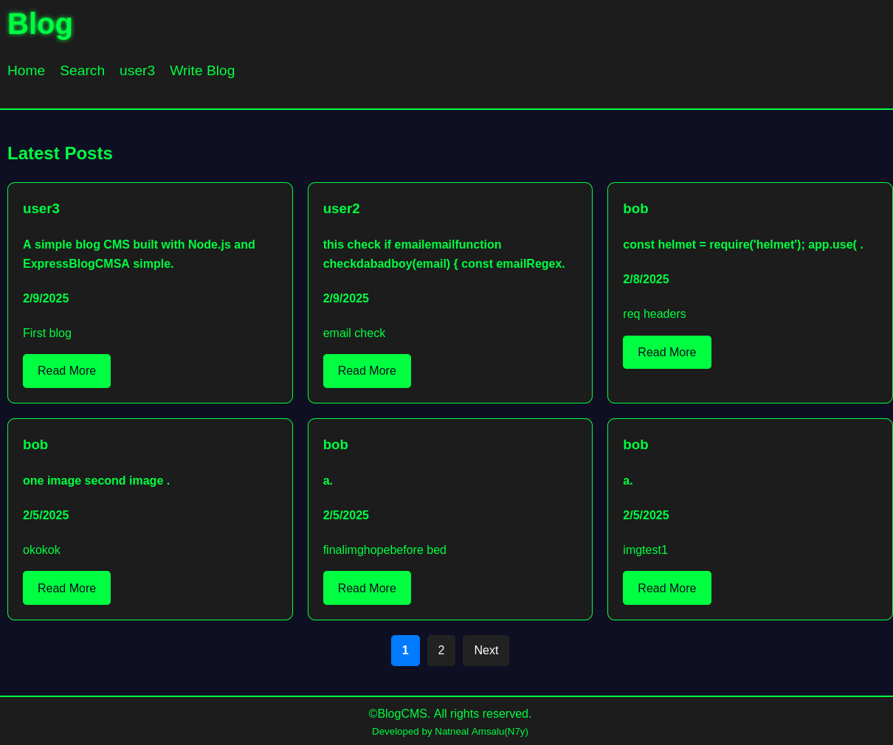
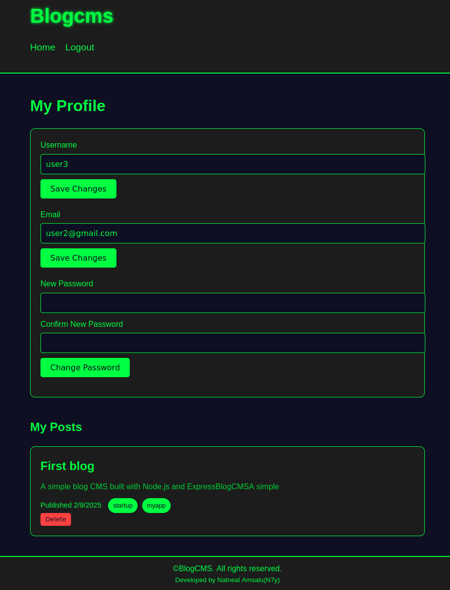
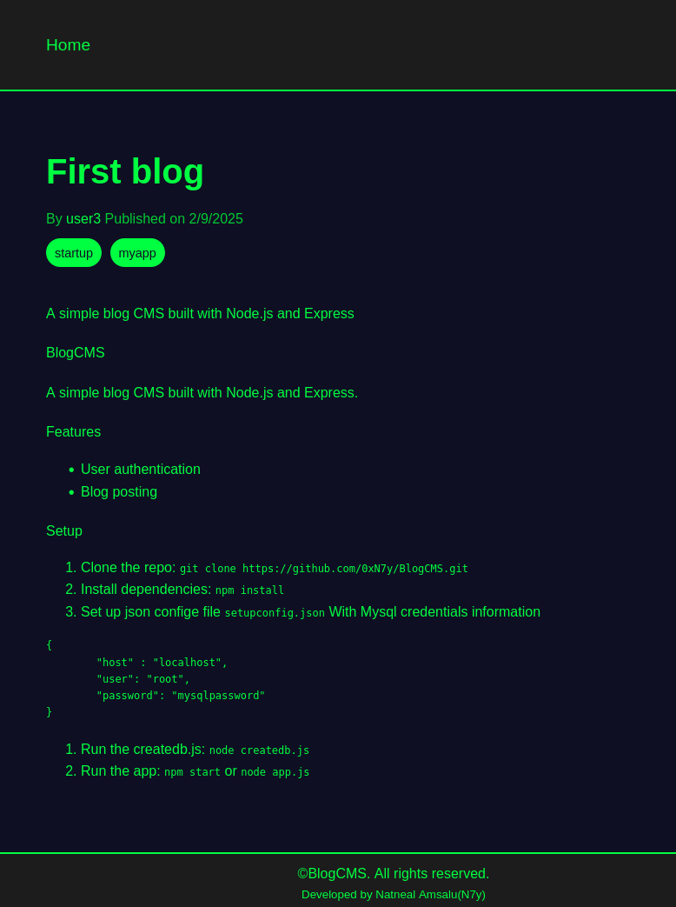
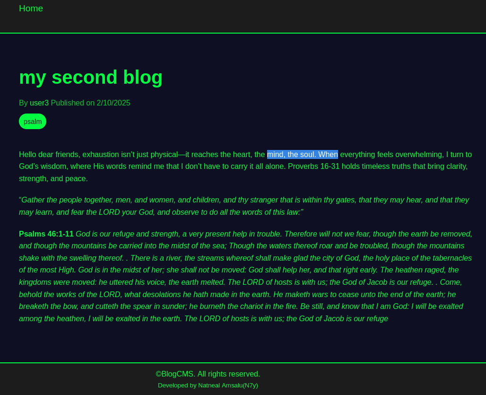
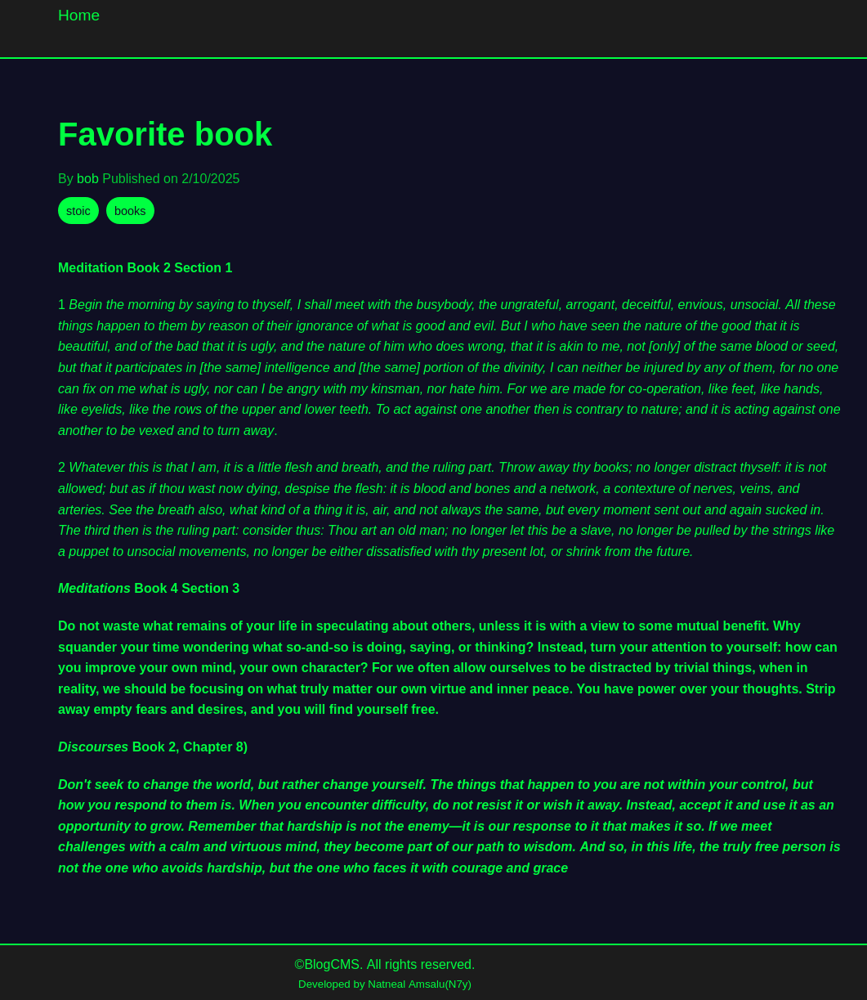

# BlogCMS
A simple blog CMS built with Node.js and Express 


## Features
- User authentication
- Blog posting
- Search functionality
  

## Setup
1. Clone the repo: `git clone https://github.com/0xN7y/BlogCMS.git`
2. Install dependencies: `npm install`
3. Set up json confige file `setupconfig.json` With Mysql credentials information
```json
{
	"host" : "localhost",
	"user": "root", 
  	"password": "mysqlpassword"
}
```
4. Create database `blogcms`
5. Run the createdb.js: `node createdb.js`
6. Run the app: `npm start` or `node app.js`

Main            |  Profile                       | Blogs
:-------------------------:|:-------------------------:|:-------------------------
  |            |  
 | 

